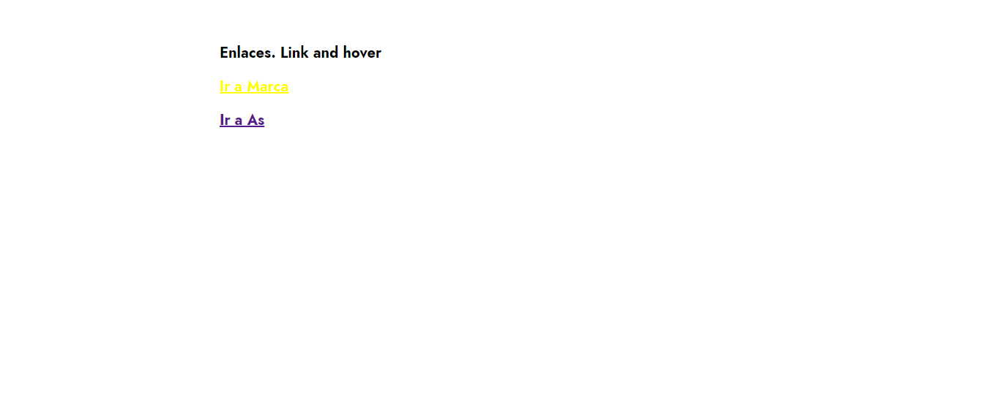

<h1>Taller 5 Luisa Fernanda Herrera Chávez </h1>

<h2> Información</h2>

Curso: full Stack Intermedio 

<h2> Punto 1: Link figma</h2>
<a href="https://www.figma.com/file/5TRo9TY6S3BrJRWJmhBkiv/Whiskers.com?type=design&node-id=2-81&mode=design&t=Gs6fpAAJHRFVl4kI-0" target="_blank">Link de Figma</a>

<h2> Punto 2-3: Página Whiskers</h2>

<h2> Punto 4: Títulos</h2>

<h2> Punto 5: Estilos de texto</h2>

<h2> Punto 6: Enlaces</h2>

<h2> Punto 7: Navegación</h2>

<h2> Punto 8: Tablas</h2>

<h2> Punto 9: Media Query Demo </h2>

<h2> Punto 10: Animaciones </h2>

<h2> Punto 11: Formulario </h2>
